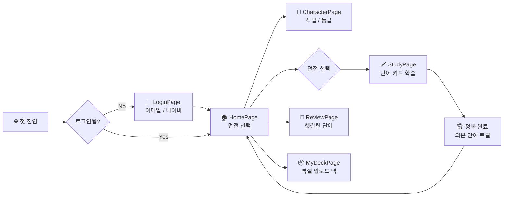

<div align="center">


<br/>


<br/>

**[ 🎮 Live Demo ](https://jlpt-rpg.vercel.app)** &nbsp;·&nbsp; **[ 📖 Supabase 설정 ](docs/SUPABASE_SETUP.md)** &nbsp;·&nbsp; **[ 🟢 네이버 OAuth ](docs/NAVER_OAUTH_SETUP.md)** &nbsp;·&nbsp; **[ 📨 이메일 템플릿 ](docs/email-templates/README.md)**

</div>

<br/>

> **`📜 새 모험가에게 보내는 두루마리`**
>
> JLPT(일본어 능력 시험) 단어를 외우며 **N5 ~ N1 던전**을 정복하는 픽셀 RPG 웹앱.
> 카드를 넘기며 단어를 학습하고, *기억 상태*에 따라 자동으로 복습할 단어가 쌓여요.
> 캐릭터를 키우고, 한자 어원/예문을 함께 익히며, 일본어 어휘를 게임처럼 정복합니다. ⚔️✨

<br/>

---

## ✨ 주요 기능

### 🏯 던전 (JLPT 레벨)

| 던전 | 레벨 | 단어 수 | 비고 |
|:---:|:---:|---:|---|
| 🟢 **초원** | N5 | **382** | PDF 어휘 248 + 관용구 6 + 유의 표현 128 (64쌍 양방향) |
| 🟡 **숲속** | N4 | **386** | PDF 어휘 288 + 유의 표현 98 (49쌍 양방향) |
| 🟠 **던전** | N3 | **806** | PDF 어휘 672 + 유의 표현 134 (67쌍 양방향) |
| 🔴 **화산** | N2 | **1,363** | 한자 어원 + 예문 2개씩 + 관용구 80개 |
| ⚫ **마왕성** | N1 | **1,266** | 한자 어원 + 예문 2개씩 |

> 💡 모든 단어에는 *한자 어원 풀이* 와 *실전 예문 2개* 가 포함되어 있어 시험 + 실사용 둘 다 노립니다.
> N5/N4/N3 의 유의 표현은 양쪽 모두 자체 단어 entry 로 등록하고, 관계는 `word_relations` 테이블의 양방향 `synonym` 으로 관리합니다.

<br/>

### 🗡️ 학습 · 전투 시스템

- 🎴 **단어 카드 학습** — 플래시카드 형식으로 단어 → 뜻 → 예문 → 한자 어원 순차 공개
- 🧠 **기억 상태 (SRS 풍)** — `처음 / 헷갈림 / 외움` 3단계로 분류 → 외운 단어는 자동 제외 가능
- 🔁 **복습 모드 (Review)** — 헷갈리는 단어만 모아 따로 학습
- 📦 **내 단어장 (MyDeck)** — 엑셀(.xlsx) 업로드로 나만의 덱 생성 / 예시 파일 다운로드 지원
- 🎯 **정복 완료 화면** — 던전 클리어 시 외운 단어 제외 토글로 다음 회독 난이도 조절

<br/>

### 🧙 캐릭터 & 픽셀 아트

- 👤 **직업 선택** — 캐릭터 페이지에서 직업별 외형 / 처치 이펙트 차별화
- ⚔️ **픽셀 도트 아트** — 칼 · 캐릭터 · 던전 · 파비콘 · OG 이미지 모두 손수 픽셀 컴포넌트화
- 🏆 **등급 (Rank) 시스템** — 정복 진행도에 따라 모험가 등급 배지 부여
- 💥 **공격 / 처치 이펙트** — `framer-motion` 기반 부드러운 픽셀 모션

<br/>

### 🔐 인증 & 동기화

- 📧 **이메일 회원가입 / 로그인** — Supabase Auth, 인증 메일은 픽셀 RPG 양피지 디자인
- 🟢 **네이버 OAuth 로그인** — Vercel 서버리스 함수(`/api/auth/naver`) + Supabase 매직링크 결합
- ☁️ **서버 동기화** — 프로필 · 진행상태 · 덱 · 단어 모두 Supabase 와 자동 동기화
- 💾 **로컬 모드 fallback** — `.env` 없으면 자동으로 LocalStorage 만 사용 (오프라인 OK)
- 📱 **PWA 설치형 앱** — 모바일 홈 화면 설치 지원, 네이버 OAuth PWA 무한 로딩 이슈도 해결됨

<br/>

---

## 🛠 기술 스택

<table>
<tr>
<td>

**🎨 Frontend**
- React 19 + Vite 6 + TypeScript 5.7
- Tailwind CSS 3.4
- React Router v7
- Zustand (영속화 포함)
- framer-motion

</td>
<td>

**☁️ Backend / Infra**
- Supabase (Auth · Postgres)
- Vercel (정적 배포 + 서버리스 함수)
- 네이버 OAuth 연동 함수
- PWA (`site.webmanifest`)

</td>
<td>

**📑 데이터**
- read-excel-file / write-excel-file
- papaparse
- `db/schema.sql` 스키마·RLS·공식 덱
- `db/n5~n1_seed.sql` PDF 어휘 시드

</td>
</tr>
</table>

<br/>

---

## 🚀 시작하기

```bash
# 1. 의존성 설치
npm install

# 2. 개발 서버 (http://localhost:5173)
npm run dev

# 3. 프로덕션 빌드
npm run build && npm run preview
```

<br/>

### ☁️ Supabase 연동 (선택)

환경변수가 없으면 자동으로 **로컬 모드**(LocalStorage)로 동작합니다.
서버 동기화·OAuth 로그인을 쓰려면 `.env.local` 을 만들고 값을 채워주세요.

```bash
cp .env.example .env.local
# Supabase URL · anon key · (선택) 네이버 OAuth 키 입력 후 dev 재시작
```

자세한 절차는 다음 문서를 참고하세요.

- 📖 [`docs/SUPABASE_SETUP.md`](docs/SUPABASE_SETUP.md) — DB 스키마 · RLS · 인증 설정
- 🟢 [`docs/NAVER_OAUTH_SETUP.md`](docs/NAVER_OAUTH_SETUP.md) — 네이버 로그인 설정
- 📨 [`docs/email-templates/README.md`](docs/email-templates/README.md) — 픽셀 RPG 이메일 4종 적용법

<br/>

---

## 📁 프로젝트 구조

```
JLPTRPG/
├── 📂 src/
│   ├── 📂 components/      # PixelSword, PixelCharacter, WordCard, RankBadge ...
│   ├── 📂 pages/           # Home · Character · Study · Review · MyDeck · Settings · Login
│   ├── 📂 store/           # authStore · profileStore · decksStore · progressStore (Zustand)
│   ├── 📂 hooks/           # useSupabaseSession · useProgressSync · useDecksSync ...
│   ├── 📂 data/            # dungeons · characters · ranks · seed
│   ├── 📂 lib/             # Supabase 클라이언트 등
│   └── App.tsx · main.tsx · types.ts
│
├── 📂 api/auth/naver/      # Vercel 서버리스 함수 (네이버 OAuth 콜백)
├── 📂 db/                  # schema.sql + n5~n1_seed.sql (Supabase SQL Editor에 순서대로 실행)
├── 📂 docs/                # Supabase / 네이버 OAuth / 이메일 템플릿 가이드
│   └── 📂 email-templates/ # 픽셀 RPG 양피지 메일 4종
├── 📂 public/              # 픽셀 favicon · apple-touch-icon · OG 이미지 · manifest
└── vercel.json · tailwind.config.js · vite.config.ts ...
```

<br/>

---

## 🧭 사용자 흐름



<br/>

---

## 📜 라이선스

MIT

<div align="center">

<br/>

**🎴 漢字ダンジョン · JLPT RPG**

<sub>*"일본어 단어를 외울 때마다 몬스터를 처치하고 등급이 오릅니다."*</sub>

</div>
