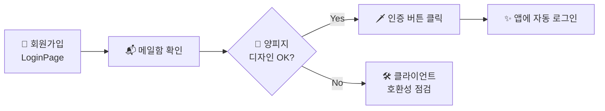

<div align="center">


<br/>


</div>

<br/>

> **`📜 두루마리에 적힌 글`**
>
> JLPT RPG 의 **양피지 · 픽셀 RPG** 컨셉에 맞춘 Supabase Auth 이메일 템플릿 4종입니다.
> 회원에게 보내지는 모든 자동 메일이 *던전 안내 두루마리* 처럼 보이도록 디자인되어 있어요.

<br/>

---

## 🗺️ 두루마리 목록

| 🪶 파일 | ⚔️ 용도 | 📮 Supabase 슬롯 | 🎨 컬러 |
|---|---|---|---|
| `confirm-signup.html` | 신규 모험가 등록 인증 | **Confirm signup** | <kbd>🟦 SkyBlue `#33c4ff`</kbd> |
| `magic-link.html` | 비밀번호 없이 입장 (마법 통로) | **Magic Link** | <kbd>🟪 Purple `#7a4cf0`</kbd> |
| `reset-password.html` | 비밀번호 재설정 (비밀의 열쇠) | **Reset Password** | <kbd>🟧 Amber `#d6a44d`</kbd> |
| `change-email.html` | 메일 주소 변경 (통신처 변경) | **Change Email Address** | <kbd>🟩 Mint `#3ecf8e`</kbd> |

<br/>

```
   ╔══════════════════════════════════════════════════════╗
   ║   📜 새 모험가에게 보내는 두루마리 (Scroll)         ║
   ║                                                      ║
   ║   어서 오게, 모험가여!                              ║
   ║   아래 룬 스톤을 두드리면 던전의 문이 열립니다.    ║
   ║                                                      ║
   ║          ▶ [ 던전 입장 (이메일 인증) ]              ║
   ║                                                      ║
   ╚══════════════════════════════════════════════════════╝
```

<br/>

---

## 🧭 적용 퀘스트 (Setup)

<details open>
<summary><b>🪄 Step 1 ~ 5 · Supabase 대시보드에 두루마리 봉인하기</b></summary>

<br/>

| 단계 | 행동 |
|:---:|---|
| **1** | <kbd>Supabase 대시보드</kbd> 접속 → 프로젝트 선택 |
| **2** | 좌측 메뉴 → <kbd>🔐 Authentication</kbd> → <kbd>Email Templates</kbd> |
| **3** | 위 [두루마리 목록](#-두루마리-목록) 표대로 슬롯 선택 |
| **4** | **Subject** 와 **Message body (HTML)** 입력 (아래 참고) |
| **5** | 우상단 **`💾 Save`** 클릭 → 봉인 완료 ✨ |

</details>

<br/>

### ✉️ 추천 Subject (제목)

| 🎴 템플릿 | 📝 추천 제목 |
|---|---|
| `Confirm signup` | `🗡️ JLPT RPG · 모험가 등록을 완료해주세요` |
| `Magic Link` | `🔮 JLPT RPG · 마법 통로가 열렸습니다` |
| `Reset Password` | `🔑 JLPT RPG · 비밀번호 재설정 링크` |
| `Change Email` | `📨 JLPT RPG · 새 메일 주소 인증` |

> 💡 **TIP** &nbsp;`Message body` 는 해당 `.html` 파일 내용을 **통째로 복사** 해 붙여넣기만 하면 됩니다.

<br/>

---

## 🌐 Site URL · Redirect URLs

이메일에 들어가는 인증 링크는 Supabase **Site URL** 을 기반으로 생성됩니다.
링크가 엉뚱한 곳으로 가지 않도록 아래를 꼭 설정하세요.

<table>
<tr>
<td>

**📍 위치**
`Authentication` → `URL Configuration`

</td>
<td>

**🏰 Site URL**
배포 사이트 주소
예: `https://jlpt-rpg.vercel.app`

</td>
</tr>
</table>

```bash
# ✅ Redirect URLs (additional) — 둘 다 등록해두면 편합니다
http://localhost:5173/**
https://jlpt-rpg.vercel.app/**
```

> 🧪 개발 중에는 Site URL 을 `http://localhost:5173` 으로 두면 로컬 dev 서버로 리다이렉트됩니다.

<br/>

---

## 🪄 Supabase 변수 (Go template)

Supabase 가 메일 발송 시 자동으로 치환해주는 변수들입니다.

| 🔮 변수 | 📖 설명 | 사용 |
|---|---|:---:|
| `{{ .ConfirmationURL }}` | 인증/재설정 링크 (모든 템플릿에서 핵심) | ✅ |
| `{{ .Email }}` | 대상 이메일 | ⚪ |
| `{{ .Token }}` | 6자리 OTP (사용 시) | ⚪ |
| `{{ .TokenHash }}` | 토큰 해시 | ⚪ |
| `{{ .SiteURL }}` | Site URL 설정 값 | ⚪ |

> 🎲 본 4종 두루마리는 가장 단순한 `{{ .ConfirmationURL }}` **하나만** 사용합니다.
> OTP 6자리 코드를 보여주고 싶다면 `{{ .Token }}` 을 추가해 *룬 코드* 처럼 꾸며보세요.

<br/>

---

## 🧪 검증 퀘스트 (Test)



<br/>

> 🎮 **체크리스트**
> - [ ] 회원가입 → 메일함에서 양피지/픽셀 디자인으로 보임
> - [ ] 인증 버튼 클릭 → 앱에 자동 로그인됨
> - [ ] Gmail · Outlook · 네이버메일에서 모두 깨지지 않음

<br/>

---

## 🛡️ 호환성 · 폰트

| 항목 | 상태 |
|---|---|
| **인라인 스타일** | ✅ 모든 CSS 가 `style="..."` 에 인라인 → 메일 클라이언트 대부분 호환 |
| **테이블 레이아웃** | ✅ `<table role="presentation">` → Outlook 까지 안정적 |
| **Google Fonts (`DotGothic16`)** | ⚠️ 일부 클라이언트에서 차단되면 fallback 폰트 사용 *(정상 동작)* |
| **다크 모드 메일 클라이언트** | ✅ 양피지 배경/픽셀 보더로 색 반전에도 가독성 유지 |

<br/>

---

## 🎨 디자인 토큰

본 두루마리들이 공유하는 픽셀 RPG 팔레트입니다.

| Token | HEX | 미리보기 | 용도 |
|---|---|:---:|---|
| `--bg-dungeon` | `#08060d` |  | 외곽 던전 배경 |
| `--bg-panel` | `#161021` |  | 상단 로고 패널 |
| `--parchment` | `#f7eccd` |  | 양피지 본문 |
| `--ink` | `#3a2410` |  | 본문 잉크 색 |
| `--accent-sky` | `#33c4ff` |  | 메인 CTA / 로고 |
| `--accent-amber` | `#d6a44d` |  | 한자 서브타이틀 |

<br/>

---

## 📁 폴더 구조

```
docs/email-templates/
├── 📜 README.md              ← 두루마리 사용 안내 (이 문서)
├── 🗡️ confirm-signup.html    ← 회원가입 인증
├── 🔮 magic-link.html         ← 매직 링크 로그인
├── 🔑 reset-password.html     ← 비밀번호 재설정
└── 📨 change-email.html       ← 이메일 변경 인증
```

<br/>

---

<div align="center">

**🎴 漢字ダンジョン · JLPT RPG**

*"일본어 단어를 외울 때마다 몬스터를 처치하고 등급이 오릅니다."*

<sub>본 두루마리들은 Supabase Auth 자동 메일 전용입니다. 마음대로 픽셀을 더 넣거나, 색을 바꿔 길드만의 색을 입혀도 좋아요. ⚔️✨</sub>

</div>
